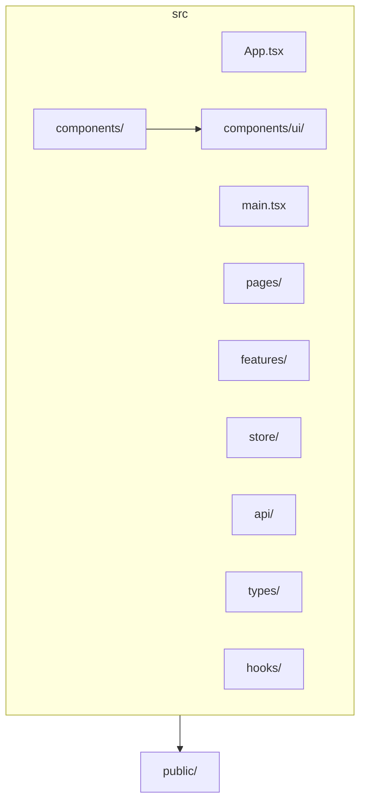
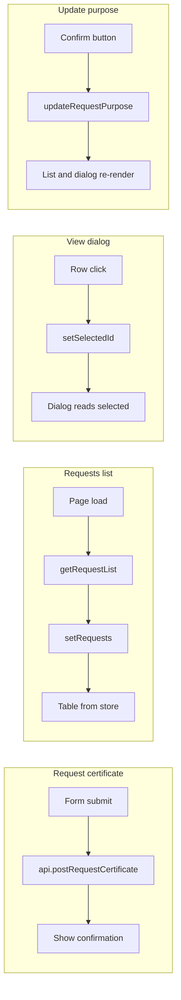

# Kamado app structure

Based on [.cursor/plans/kamado-tech-stack.md](.cursor/plans/kamado-tech-stack.md) and [.cursor/plans/kamado-case-study-visual-plan.md](.cursor/plans/kamado-case-study-visual-plan.md), plus [.cursor/pdf/app-routes-draft.md](.cursor/pdf/app-routes-draft.md).

---

## 1. Target folder structure

Proposed `src/` layout aligned with the stack and features:

| Path | Purpose |
|------|---------|
| **`src/components/`** | Shared UI: shell header, nav, optional `Sheet` for mobile. |
| **`src/components/ui/`** | shadcn/ui primitives (Button, Input, Dialog, Table, etc.) after `npx shadcn@latest init`. |
| **`src/pages/`** | Route-level containers: `HomePage`, `RequestCertificatePage`, `RequestsListPage`. |
| **`src/features/`** | Feature-specific components and logic. Use subfolders: `request-certificate/` (form for F02), `requests-list/` (table + filters for F04, view/update dialog for F05/F06). Alternative: keep these under `pages/` with subfolders; this plan uses a dedicated `features/` convention. |
| **`src/store/`** | Redux Toolkit: `index.ts` (configureStore), `slices/` (e.g. `requestsSlice.ts` for list + selected request; optional `uiSlice` for dialog open/close if not local state). |
| **`src/api/`** | API client: base URL + subscription key from env, `postRequestCertificate`, `getRequestList` (fetch wrappers). |
| **`src/types/`** | TypeScript types: request/certificate DTOs, API response shapes, form types. |
| **`src/hooks/`** | Optional custom hooks (e.g. `useRequestForm`, `useRequestList`). |
| **`src/App.tsx`** | Router provider, layout with outlet. |
| **`src/main.tsx`** | Entry; wrap app with Redux `Provider` if not already. |
| **`public/`** | Static assets; optional placeholder or sample PDF for F05-R02. |

No extra top-level folders beyond the case study needs (e.g. no `layouts/`; shell lives in `components/` or as a single `AppLayout` component).

### Folder tree (high-level)



---

## 2. Route and layout hierarchy

### Routes (from app-routes-draft)

| Route | Page | Content |
|-------|------|---------|
| `/` | Home | Empty or minimal placeholder; nav to Request Certificate or Requests List. |
| `/request-certificate` | Request Certificate | Form + submit (F02). |
| `/requests` | Requests List | Table + sort/filter; row action opens view dialog (F04, F05, F06). |

View/update is a full-screen dialog over the list — no extra route.

### Layout

One shell: header (logo/app name) + nav links (Home, Request Certificate, Requests List). Content area is a React Router `<Outlet />` rendering the active page. Mobile: optional `Sheet` for nav drawer.

```mermaid
flowchart TD
  App[App]
  AppLayout[AppLayout "Shell"]
  Nav[Nav links]
  Outlet[Outlet]
  HomePage[HomePage]
  RequestCertPage[RequestCertificatePage]
  RequestsListPage[RequestsListPage]
  App --> AppLayout
  AppLayout --> Nav
  AppLayout --> Outlet
  Outlet --> HomePage
  Outlet --> RequestCertPage
  Outlet --> RequestsListPage
```

---

## 3. Component tree (by feature)

| Feature | Component(s) | Responsibility |
|---------|--------------|-----------------|
| **F01 – Shell** | `AppLayout` or `Shell` | Logo/app name, nav links (React Router `Link`/`NavLink`), `<Outlet />`. Optionally `Sheet` for mobile nav. |
| **F02 – Request certificate** | `RequestCertificatePage` → `RequestCertificateForm` | Form with shadcn `Input`, `Textarea`, `Label`, `Calendar`+`Popover`, `Button`. React Hook Form + Zod. On submit → `api.postRequestCertificate` → show success message. |
| **F04 – Requests list** | `RequestsListPage` → table + filters | shadcn `Table` with columns (Reference No., Address to, Purpose, Issued on, Status, action). Filter inputs/selects (Reference No. full match, Address to contains, Status). Sort by Issued on, Status. Data from Redux (filled by `getRequestList` on load). Row action → open view dialog. |
| **F05 – View request** | `ViewRequestDialog` | Full-screen shadcn `Dialog`. Left: Reference No., Address to, Purpose, Issued on (if Done), Status. Right: PDF via `<object>`/`<iframe>` or “Certificate is yet to be issued.” Owned by `RequestsListPage` or parent holding dialog state. |
| **F06 – Update purpose** | Same `ViewRequestDialog` | When status = “New”: editable Purpose (e.g. shadcn `Textarea`) + Confirm button. On confirm → update Redux only (no API); list and dialog re-render from store. |

---

## 4. Redux store shape

### State

- **`requests` slice:** e.g. `{ items: Request[], selectedId: string | null, loading: boolean, error: string | null }`. List and dialog both read from this slice; F06 updates `items` in place.
- **Optional `ui` slice:** e.g. dialog open/close if not held in local state (e.g. `selectedId !== null` can drive “dialog open” and selected request).

### Actions (examples)

| Action | Purpose |
|--------|---------|
| `setRequests` | Set list after GET request-list. |
| `setSelectedRequest` / `setSelectedId` | Open dialog for a request; clear to close. |
| `updateRequestPurpose` | F06: update purpose of request by id in `items` (no API). |
| `setLoading` / `setError` | Loading and error state for list fetch. |

### Data loading

- **Option A:** Thunks in the slice (e.g. `fetchRequestList`) that call `getRequestList()` then `dispatch(setRequests(data))`.
- **Option B:** Component-level fetch in `RequestsListPage` (e.g. `useEffect`) then `dispatch(setRequests(data))`.

---

## 5. Data flow (high-level)



| Flow | Steps |
|------|--------|
| **Request certificate** | Form submit → `api.postRequestCertificate` → success → show confirmation (local state or small UI slice). |
| **Requests list** | Page load/mount → `getRequestList` → dispatch `setRequests` → table reads from store; sort/filter derived in selector or component (client-side). |
| **View dialog** | Row click → set `selectedId` (or selected request); dialog reads selected from store; PDF from mock/base64/static file based on status. |
| **Update purpose** | Dialog confirm → `updateRequestPurpose` → store updated → list and dialog both show new purpose. |

---

## 6. Summary

| Section | Contents |
|---------|----------|
| **Folder structure** | `src/components`, `components/ui`, `pages`, `features`, `store`, `api`, `types`, `hooks`; `App.tsx`, `main.tsx`; `public/`. |
| **Routes** | `/`, `/request-certificate`, `/requests`; view/update via dialog, no route. |
| **Layout** | App → AppLayout (Shell + Outlet) → HomePage \| RequestCertificatePage \| RequestsListPage. |
| **Components** | Shell (F01), RequestCertificateForm (F02), RequestsListPage + table/filters (F04), ViewRequestDialog (F05, F06). |
| **Redux** | `requests` slice: `items`, `selectedId`, `loading`, `error`; actions for set list, set selected, update purpose. |
| **Data flow** | Form → API → confirmation; list → GET → store → table; row → selectedId → dialog; confirm → update store → re-render. |

This document is reference only for implementation; no code or tooling changes are implied.
