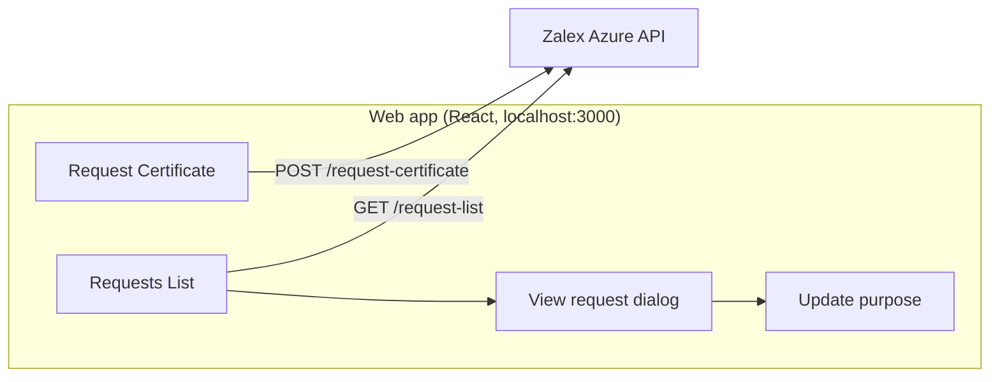
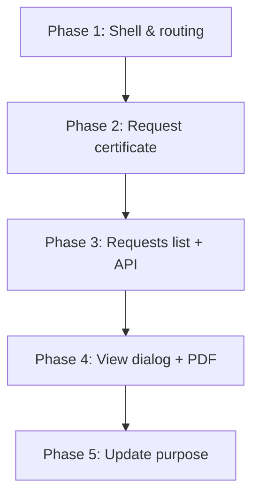

# Kamado – Senior FE Developer Case Study – Visual Plan

**Source:** [Senior FE Developer Case Study.pdf](../pdf/Senior%20FE%20Developer%20Case%20Study.pdf)

---

## 1. Context & objective

| | |
|---|---|
| **Product** | Zalex Inc. Employee Certification Solution (MVP) |
| **Business objective** | Simplify how employees obtain their certificate of employment. |
| **Context** | FAB HR platform has no certificate generation; HR/line managers currently handle letters manually. MVP to prove benefits before scaling. |

---

## 2. High-level flow

**User journey (simplified):** Request certificate → See confirmation → Open Requests List → Sort/Filter → Open one request (dialog) → View details + PDF (if Done) → Optionally update purpose (if New) → Changes reflect in list.

---

## 3. Feature ↔ requirement map

| Feature | ID | Summary | Requirements |
|--------|----|---------|--------------|
| **Web app** | F01 | React SPA, browser, no Next.js | F01-R01: React front-end |
| **Request certificate** | F02 | Submit & validate certificate request | F02-R01 … F02-R04 (form, validation, API, confirmation) |
| **List certificates** | F04* | List, sort, filter requests | F04-R01 … F04-R04 (table, sort, filter, API) |
| **View one request** | F05 | Full-screen dialog + PDF viewer | F05-R01, F05-R02 |
| **Update request** | F06 | Edit purpose (New only), no backend call | F06-R01, F06-R02 |

*Backlog labels “List” as F03; requirements section uses **F04** for list. This plan follows the requirement IDs (F04/F05/F06).

---

## 4. Requirements in detail

### F01 – Web-based application

| Req | What |
|-----|------|
| F01-R01 | App built with **React** (no Next.js required). |

---

### F02 – Request certificate

| Req | What |
|-----|------|
| F02-R01 | “Request Certificate” form with: **Address to** (text, alphanumeric, required), **Purpose** (text with styling, min 50 chars, required), **Issued on** (date, future only, required), **Employee ID** (text, numeric only, required). |
| F02-R02 | **In-line validation** before submit; show error messages per field. |
| F02-R03 | On submit → **POST** to backend (see API section). |
| F02-R04 | On success (response “Ok”) → show **confirmation message**. |

---

### F04 – List all relevant certificates

| Req | What |
|-----|------|
| F04-R01 | “Requests List” page: **table** with columns: Reference No., Address to, Purpose, Issued on, Status. |
| F04-R02 | **Sort** by Issued on, Status (asc/desc via headers). Reference No. / Address to / Purpose: no sort. |
| F04-R03 | **Filter**: Reference No. (full match), Address to (contains), Status (full match). Purpose & Issued on optional. |
| F04-R04 | Load list via **GET** API (see below). |

---

### F05 – View individual certificate request

| Req | What |
|-----|------|
| F05-R01 | Last column **icon** opens **full-screen dialog** with: Reference No., Address to, Purpose, Issued on (only if status = “Done”), Status. |
| F05-R02 | **Right side of dialog**: document viewer. If issued → show **PDF**. If not issued → “Certificate is yet to be issued.” (No API for PDF – choose storage/display approach.) |

---

### F06 – Update a certificate request

| Req | What |
|-----|------|
| F06-R01 | In dialog, **purpose** editable only when status = **“New”**. Confirm with a button. |
| F06-R02 | After update, **list behind dialog** shows new purpose **without refresh** (no backend update required). |

---

### Other

| Req | What |
|-----|------|
| T-01 | *(Optional)* Deploy and host online. |

---

## 5. APIs (summary)

| Use | Method | Endpoint | Auth | Body / response |
|-----|--------|----------|------|------------------|
| Create request | POST | `https://zalexinc.azure-api.net/request-certificate?subscription-key=<KEY>` | API Key | Body: `address_to`, `purpose`, `issued_on`, `employee_id`. Response: `{ "responce": "Ok" }`. |
| List requests | GET | `https://zalexinc.azure-api.net/request-list?subscription-key=<KEY>` | API Key | No body. Response: array of `{ address_to, purpose, issued_on, employee_id, … }`. |

- **API key:** from separate email; use in query or header as required.
- **Base URL / key:** consider `.env` with `VITE_API_SUBSCRIPTION_KEY` (or similar) for local dev.

---

## 6. Request form fields (quick ref)

| Field | Type | Rules | Required |
|-------|------|-------|----------|
| Address to | Text area | Alphanumeric | Yes |
| Purpose | Text area (styling) | Min 50 characters | Yes |
| Issued on | Date | Future only | Yes |
| Employee ID | Text | Numeric only | Yes |

---

## 7. List table (quick ref)

| Column | Sort | Filter |
|--------|------|--------|
| Reference No. | No | Yes – full match |
| Address to | No | Yes – contains |
| Purpose | No | Optional |
| Issued on | Yes | Optional |
| Status | Yes | Yes – full match |
| *(last)* | — | Action icon → open dialog |

---

## 8. Suggested implementation order

1. **Phase 1 – Shell & routing**  
   App shell, nav (e.g. “Request Certificate”, “Requests List”), React Router, Redux store shape. Ensure dev server runs on **localhost:3000**.

2. **Phase 2 – Request certificate (F02)**  
   Form with all fields, validation (F02-R01, F02-R02), POST to create endpoint, success message (F02-R04).

3. **Phase 3 – Requests list (F04)**  
   GET request-list, table with columns, sort (Issued on, Status), filters (Reference No., Address to, Status).

4. **Phase 4 – View request (F05)**  
   Row action → full-screen dialog, show all fields (Issued on only if status = “Done”). Right side: PDF viewer or “Certificate is yet to be issued.” (Decide how to store/serve PDF – e.g. mock URL, base64, or static sample.)

5. **Phase 5 – Update purpose (F06)**  
   In dialog, editable purpose when status = “New”, confirm button, update Redux/local state so list updates without refresh and without calling backend.

---

## 9. Tech & constraints

| Item | Constraint |
|------|------------|
| Stack | **React**, **React Redux** (per org standards). |
| Dev server | **localhost:3000** (required for API CORS). |
| API style | REST; API key in query (or as per API docs). |
| PDF | No API for document; choose storage/display approach. |
| Update request | No backend call; in-memory/Redux update only. |

**Out of scope (per case study):** Authentication, building backend APIs, live production APIs, security testing.

---

## 10. Checklist (for implementation)

- [ ] F01-R01 – React app, runs on localhost:3000
- [ ] F02-R01 – Request form (Address to, Purpose, Issued on, Employee ID)
- [ ] F02-R02 – In-line validation + error messages
- [ ] F02-R03 – POST request-certificate with API key
- [ ] F02-R04 – Success confirmation message
- [ ] F04-R01 – Requests list table (all columns)
- [ ] F04-R02 – Sort by Issued on, Status
- [ ] F04-R03 – Filter by Reference No., Address to, Status
- [ ] F04-R04 – GET request-list on load
- [ ] F05-R01 – Dialog from row icon, all fields (Issued on if Done)
- [ ] F05-R02 – PDF viewer or “Certificate is yet to be issued”
- [ ] F06-R01 – Editable purpose when status New + confirm button
- [ ] F06-R02 – List updates without refresh
- [ ] (Optional) T-01 – Deploy online
