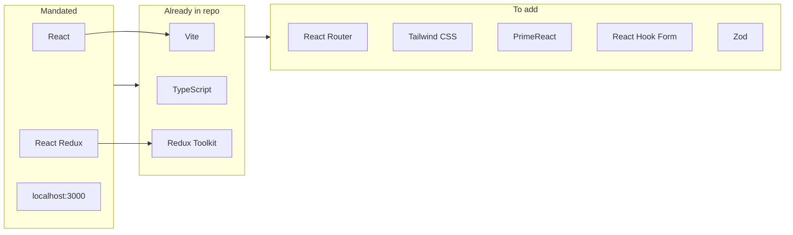

# Tech stack recommendation for Kamado (Zalex Employee Certification MVP)

Based on [.cursor/plans/kamado-case-study-visual-plan.md](.cursor/plans/kamado-case-study-visual-plan.md), [.cursor/pdf/Senior FE Developer Case Study.pdf](.cursor/pdf/Senior%20FE%20Developer%20Case%20Study.pdf), and [.cursor/pdf/app-routes-draft.md](.cursor/pdf/app-routes-draft.md), plus the current [package.json](package.json).

---

## Mandated by the case study

| Item                 | Requirement                                                         |
| -------------------- | ------------------------------------------------------------------- |
| **UI framework**     | React (no Next.js)                                                  |
| **State management** | React Redux                                                         |
| **Dev server**       | Must run on **localhost:3000** (required for API CORS)              |
| **API**              | REST; API key in query (e.g. `VITE_API_SUBSCRIPTION_KEY` in `.env`) |

These are non-negotiable per the case study and org standards.

---

## Recommended stack (aligned with your repo and the plan)

### Already in the project

- **Build & dev:** [Vite](https://vitejs.dev/) — matches the plan's `.env` hint (`VITE_API_SUBSCRIPTION_KEY`) and gives fast HMR; ensure dev server is configured to use port **3000** (e.g. `server.port: 3000` in `vite.config`).
- **Language:** TypeScript — already in use; good fit for form types, API response shapes, and Redux state.
- **State:** **Redux Toolkit** + **react-redux** — satisfies "React Redux"; RTK is the standard way to use Redux in new apps.
- **React:** React 19 — current and supported.
- **Tooling:** ESLint, Prettier — already configured.

### Add for the SPA and features

- **Routing:** **React Router** (e.g. `react-router-dom` v6) — for `/`, `/request-certificate`, `/requests` and the shell layout with an outlet as in the [app-routes-draft](.cursor/pdf/app-routes-draft.md).
- **Styling:** **PrimeReact theme** — use the **bootstrap-blue-light** style (built-in theme: `bootstrap4-light-blue`). Import `primereact/resources/themes/bootstrap4-light-blue/theme.css` and `primereact/resources/primereact.min.css`; add `primeicons/primeicons.css` for icons. Use **Tailwind CSS** or **PrimeFlex** for layout, breakpoints (mobile-first), and utilities.
- **Component library:** **PrimeReact** — use theme **bootstrap4-light-blue** (bootstrap blue light style). Wrap the app with `PrimeReactProvider` from `primereact/api`. Use the components listed in **Notes** below.
- **Forms & validation:** **React Hook Form** + **Zod** (or **Yup**) — in-line validation (F02-R02), typed schema for "Address to", "Purpose" (min 50 chars), "Issued on" (future only), "Employee ID" (numeric).
- **HTTP client:** **fetch** (native) — sufficient for POST `/request-certificate` and GET `/request-list` with the API key; no need for axios unless you prefer it.
- **PDF in dialog (F05-R02):** Use the **browser's built-in PDF viewer** (e.g. `<object>` or `<iframe>` with a `blob:` or mock URL). Case study says "browser PDF viewer is sufficient" and leaves storage/display to you — e.g. mock URL, base64, or static sample PDF for "Done" status; no backend PDF API.

### Mobile-first approach

**Yes — the current stack supports mobile-first; no need to change it.**

- **React / Vite / Redux / React Router / React Hook Form** — Framework and tooling are layout-agnostic. Mobile-first is implemented via CSS and layout structure.
- **PrimeReact + Tailwind/PrimeFlex:** Use Tailwind or PrimeFlex breakpoints (e.g. `flex flex-column md:flex-row`, `w-full`) and responsive utilities. Stack form fields vertically; use full-width inputs. For the requests list, use PrimeReact DataTable (horizontal scroll on small screens) or a card/list layout for very small viewports. Full-screen Dialog (F05) already suits mobile; keep touch-friendly close/actions. Use a responsive shell (e.g. Sidebar or Menu for mobile nav, horizontal nav on larger).
- **Implementation:** Design for small viewports first, then `md:` / `lg:` for tablet/desktop. Use viewport meta tag and touch-friendly tap targets.

## Summary diagram



---

## Checklist vs case study

- **F01-R01:** React app, localhost:3000 — Vite + React; set `server.port: 3000`.
- **F02:** Form + validation + POST + confirmation — React Hook Form + Zod (or Yup) + fetch.
- **F04:** List + sort + filter + GET — table (native or UI lib), Redux (or local state) for list data, fetch for `request-list`.
- **F05:** Full-screen dialog + PDF or "Certificate is yet to be issued" — React Router or modal + `<object>`/`<iframe>` for PDF; mock or base64 for "Done".
- **F06:** Update purpose (New only), no backend — Redux (or shared state) update in dialog; list reads same store so it updates without refresh.

---

## Recommended stack list (concise)

| Layer                 | Choice                            | Note                                             |
| --------------------- | --------------------------------- | ------------------------------------------------ |
| Build / dev           | Vite                              | Already there; set port 3000                     |
| Language              | TypeScript                        | Already there                                    |
| UI framework          | React 19                          | Already there                                    |
| State                 | Redux Toolkit + react-redux       | Already there                                    |
| Routing               | react-router-dom                  | Add                                              |
| Forms & validation    | React Hook Form + Zod             | Add for F02                                      |
| HTTP                  | fetch                             | No extra dependency                              |
| PDF                   | Browser (`<object>` / `<iframe>`) | Mock or base64 for "Done"                         |
| Styling               | PrimeReact theme + Tailwind/PrimeFlex | Theme: **bootstrap4-light-blue** (bootstrap blue light); layout/breakpoints via Tailwind or PrimeFlex |
| **Component library** | **PrimeReact**                    | Theme: bootstrap-blue-light style; see Notes below |

This keeps the stack minimal, matches the case study and visual plan, and fits the existing Kamado repo.

---

## Notes – PrimeReact components and setup

**Theme:** Use **bootstrap-blue-light** style via the built-in theme `bootstrap4-light-blue`. In your app entry (e.g. `main.tsx`):

```ts
import 'primereact/resources/themes/bootstrap4-light-blue/theme.css';
import 'primereact/resources/primereact.min.css';
import 'primeicons/primeicons.css';
```

Wrap the app with `PrimeReactProvider` from `primereact/api`.

| Feature / area                     | PrimeReact components                                      | Use                                                                                                                                                                                                                                                                                                                                                                        |
| ---------------------------------- | ---------------------------------------------------------- | -------------------------------------------------------------------------------------------------------------------------------------------------------------------------------------------------------------------------------------------------------------------------------------------------------------------------------------------------------------------------- |
| **App shell / layout**             | `Button`, `Sidebar` or `Menu` (optional)                   | Nav links (Home, Request Certificate, Requests List). `Sidebar` or `Menu` for mobile drawer if desired.                                                                                                                                                                                                                                                                   |
| **F02 – Request Certificate form** | `Button`, `InputText`, `InputTextarea`, `Calendar`, `FloatLabel` | **Address to:** InputText or InputTextarea (alphanumeric). **Purpose:** InputTextarea (min 50 chars). **Issued on:** Calendar with `minDate` / date restriction for future only. **Employee ID:** InputText (numeric). Submit **Button**. Use **FloatLabel** or labels for field labels.                                                                                   |
| **F04 – Requests list**            | `DataTable`, `InputText`, `Dropdown`, `Button`             | **DataTable** for columns: Reference No., Address to, Purpose, Issued on, Status, and action column. **InputText** for filter fields (Reference No. full match, Address to contains). **Dropdown** for Status filter. **Button** (icon) in last column to open view dialog. Implement sort on Issued on and Status via DataTable or in code.                               |
| **F05 – View request dialog**      | `Dialog`, `Button`                                        | Full-screen **Dialog**: left side — Reference No., Address to, Purpose, Issued on (if Done), Status; right side — PDF viewer (`<object>`/`<iframe>`) or "Certificate is yet to be issued." **Button** to close.                                                                                                                                                            |
| **F06 – Update purpose**           | `InputTextarea`, `Button`                                 | Inside same Dialog: **InputTextarea** for purpose (editable only when status = "New"). **Button** "Confirm" to apply; update Redux/local state so list behind updates without refresh.                                                                                                                                                                                    |

**Summary – components:** `Button`, `InputText`, `InputTextarea`, `FloatLabel`, `Calendar`, `DataTable`, `Dropdown`, `Dialog`, and optionally `Sidebar` or `Menu` for mobile nav. Use `date-fns` with Calendar as needed.
